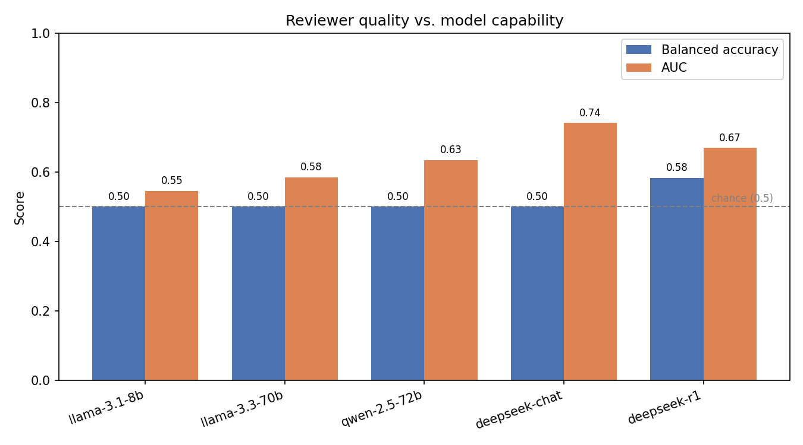
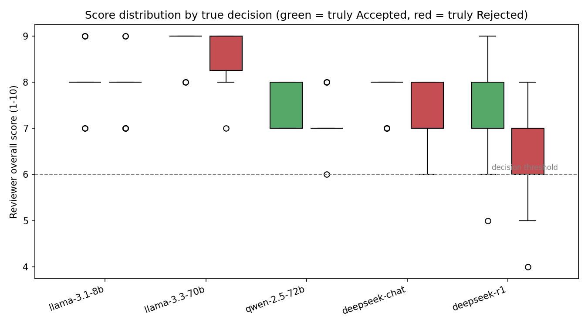
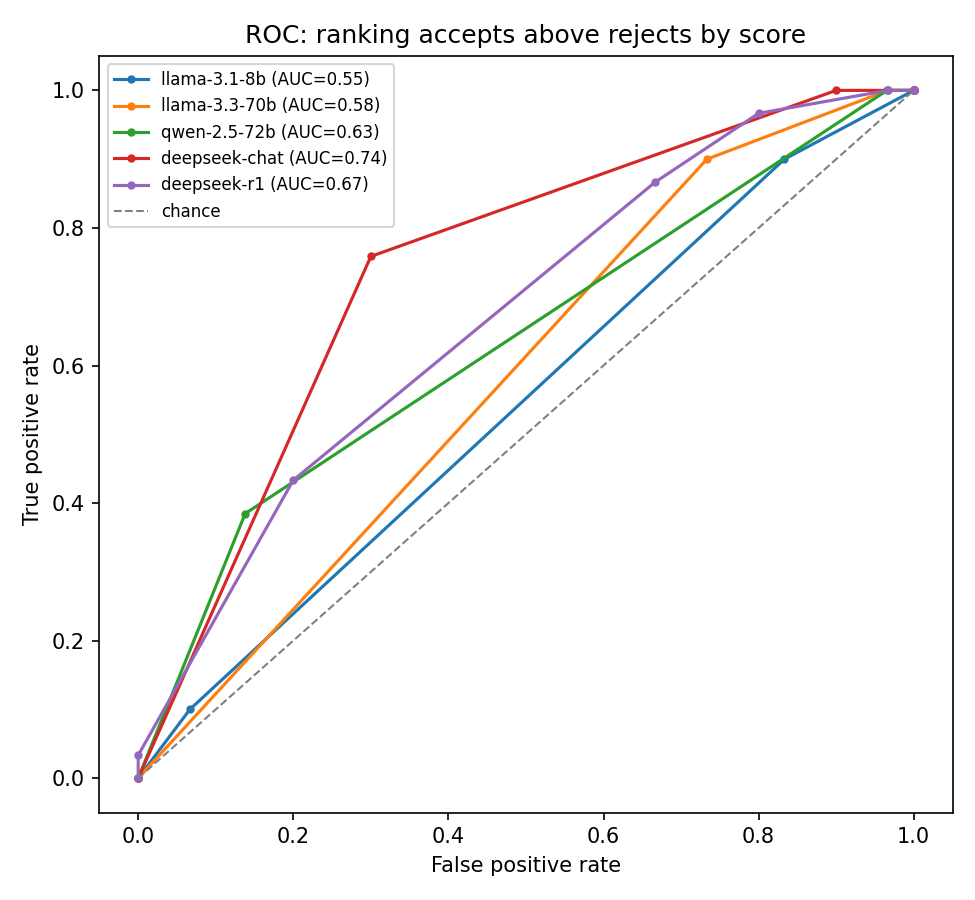

# Automated Reviewer — a recreation of the Automated Reviewer from *The AI Scientist*

A follow-up study for CS 162. We recreate the **Automated Reviewer** component of
Lu et al., *"Towards end-to-end automation of AI research"* (Nature 651, 2026 —
"The AI Scientist"), and use it to ask a question the paper raises but does not
isolate: **how does an LLM's ability to peer-review a paper scale with model
capability?**

We prompt a range of LLMs — open-source through mid-tier — to act as conference
reviewers on real ICLR submissions, and score their accept/reject judgements
against the venue's published decisions.

> **Headline result:** four of five models collapse to accepting *every* paper.
> Only the strongest (a reasoning model) issues any rejections. But the raw 1–10
> scores carry graded, capability-dependent signal **even when the binary
> decision does not** — the latent score and the decision are partly decoupled.

---

## 1. Methodology

### 1.1 Data

- **Source:** ICLR 2024 submissions via the **OpenReview API**. ICLR is the only
  major ML venue that publishes *both* accept and reject decisions, which gives
  us ground-truth labels.
- **Sample:** **60 papers, balanced 30 Accept / 30 Reject.** Of 7,404 ICLR 2024
  submissions, 5,780 have a public decision; we sampled from those. Balancing
  makes plain accuracy interpretable, though it changes the base rate (real
  ICLR acceptance is ~30%) — see Limitations.
- **Input:** the **full extracted paper text** (via `pypdf`). When a paper
  exceeds a model's context window it is **tail-truncated** (head kept,
  appendix dropped).

### 1.2 Reviewer design

Each paper is sent to an LLM prompted with **NeurIPS-style reviewer
guidelines**. The model returns a strict JSON review:

| Field | Scale |
|---|---|
| `soundness`, `presentation`, `contribution` | integer 1–4 |
| `overall` | integer 1–10 |
| `confidence` | integer 1–5 |
| `decision` | `Accept` / `Reject` |
| `summary`, `strengths`, `weaknesses`, `questions`, `limitations` | free text |

**Decision rule:** `Accept` iff `overall ≥ 6` (the model also emits its own
verdict; we keep it consistent with the score).

The pipeline also supports a **5-review ensemble + area-chair meta-review** (the
paper's full design). Results below use **1 review per paper** — the ensemble is
the planned next step.

### 1.3 Models evaluated

A capability ladder, weak → strong, all run through OpenRouter:

| Model | Tier |
|---|---|
| `llama-3.1-8b-instruct` | small open-source |
| `llama-3.3-70b-instruct` | mid open-source |
| `qwen-2.5-72b-instruct` | mid open-source |
| `deepseek-chat` (DeepSeek V3) | strong open-source |
| `deepseek-r1` | strong open-source **reasoning** model |

### 1.4 Metrics

Computed against ground truth with `Accept` as the positive class: **accuracy,
balanced accuracy** (mean of per-class recall — robust to imbalance),
**precision, recall, F1, AUC** (threshold-free score ranking), **FPR/FNR**, plus
a 5,000-resample bootstrap 95% CI on balanced accuracy.

---

## 2. How to reproduce

```bash
# 1. Install
python3 -m venv .venv && source .venv/bin/activate
pip install -r requirements.txt

# 2. API key — copy .env.example to .env and add OPENROUTER_API_KEY
cp .env.example .env        # then edit .env

# 3. Fetch 60 balanced ICLR 2024 papers (no API key needed for this step)
python -m automated_reviewer.fetch --n 60 --balanced

# 4. Run the reviewer for each model
python -m automated_reviewer.review --provider openrouter \
    --model meta-llama/llama-3.3-70b-instruct \
    --out results/reviews_llama-3.3-70b.json
#   ...repeat per model. qwen needs --max-chars 80000 (32k context limit).

# 5. Score each run
python -m automated_reviewer.evaluate \
    --reviews results/reviews_llama-3.3-70b.json \
    --out results/metrics_llama-3.3-70b.json

# 6. Generate figures + combined table
python -m automated_reviewer.make_figures
```

---

## 3. Results

### 3.1 Main comparison

| Model | n | Balanced acc. | 95% CI | Accuracy | AUC | F1 | FPR | FNR |
|---|---|---|---|---|---|---|---|---|
| llama-3.1-8b | 60 | 0.500 | [0.50, 0.50] | 0.500 | 0.545 | 0.667 | 1.00 | 0.00 |
| llama-3.3-70b | 60 | 0.500 | [0.50, 0.50] | 0.500 | 0.585 | 0.667 | 1.00 | 0.00 |
| qwen-2.5-72b | 55 | 0.500 | [0.50, 0.50] | 0.473 | 0.634 | 0.642 | 1.00 | 0.00 |
| deepseek-chat (V3) | 59 | 0.500 | [0.50, 0.50] | 0.492 | **0.741** | 0.659 | 1.00 | 0.00 |
| **deepseek-r1** | 60 | **0.583** | [0.49, 0.68] | **0.583** | 0.669 | 0.684 | 0.73 | 0.10 |

*n < 60 for qwen and deepseek-chat: a few papers failed with API errors and were
skipped rather than crashing the run.*

### 3.2 Figures

**Reviewer quality vs. model capability** — balanced accuracy (the binary
decision) is pinned at the 0.50 chance line for four of five models; AUC (the
score ranking) climbs with capability.



**Score distribution by true decision** — green = papers that were truly
Accepted, red = truly Rejected. Weak models pile every paper above the dashed
decision threshold; only `deepseek-r1` produces scores below it, and only it
shows visible green-vs-red separation.



**ROC curves** — how well each model's raw score ranks accepts above rejects,
independent of the decision threshold. `deepseek-chat` has the best ranking
(AUC 0.74) despite never issuing a reject.



### 3.3 Decisions and score behaviour

| Model | Confusion (TP/FP/FN/TN) | Decisions | Mean `overall` | Score range |
|---|---|---|---|---|
| llama-3.1-8b | 30 / 30 / 0 / 0 | 60/60 Accept | 7.95 | 7–9 |
| llama-3.3-70b | 30 / 30 / 0 / 0 | 60/60 Accept | 8.80 | 7–9 |
| qwen-2.5-72b | 26 / 29 / 0 / 0 | 55/55 Accept | 7.24 | 6–8 |
| deepseek-chat | 29 / 30 / 0 / 0 | 59/59 Accept | 7.47 | 6–8 |
| deepseek-r1 | 27 / 22 / 3 / 8 | **11 Reject** (8 correct) | 6.97 | **4–9** |

### 3.4 Mean sub-scores

| Model | Soundness | Presentation | Contribution | Confidence |
|---|---|---|---|---|
| llama-3.1-8b | 3.67 | 3.90 | 3.75 | 4.67 |
| llama-3.3-70b | 3.98 | 3.93 | 3.98 | 4.87 |
| qwen-2.5-72b | 3.33 | 3.53 | 3.24 | 4.00 |
| deepseek-chat | 3.61 | 3.46 | 3.61 | 4.00 |
| deepseek-r1 | 3.20 | 3.22 | 3.25 | 4.02 |

---

## 4. Findings (for the write-up)

**F1. The accept/reject decision collapses to constant-Accept below a
capability threshold.** Four of five models accepted *every* paper (FPR = 1.00,
FNR = 0.00), giving balanced accuracy exactly 0.500 — indistinguishable from a
coin flip. This is not a bug: these models genuinely never score a real,
polished ICLR submission below the acceptance threshold. → *suggests there is a
model-capability floor for calibrated peer-review decisions.*

**F2. Only the reasoning model breaks the collapse — but not yet significantly.**
`deepseek-r1` rejected 11 papers (8 correct), reaching balanced accuracy 0.583.
However its 95% CI is [0.49, 0.68], which includes 0.50 — at n = 60 it is **not
statistically distinguishable from chance**. The direction is right; the sample
is too small for a strong claim. → *report as a trend, not a result; the
contamination split and larger n are needed.*

**F3. Decision quality and score quality are decoupled.** AUC measures whether
the raw 1–10 score *ranks* accepts above rejects, ignoring the decision. It
rises with capability — 0.55 → 0.59 → 0.63 → **0.74** — even though those four
models all decide "Accept everything." `deepseek-chat` has the *best* score
ranking (AUC 0.74) yet never converts it into a rejection. → *mid models develop
informative scores before they develop the calibration to act on them. This is
a sharper claim than "bigger model = better reviewer," and it is the strongest
contribution of the study.*

**F4. Score calibration tracks capability.** Weak models compress their scores
into a narrow, inflated band (`llama-3.3-70b`: mean 8.80, range 7–9).
`deepseek-r1` is the only model that uses the full range (4–9, mean 6.97) and
the only one that produces visible accept/reject separation (Figure 2).

**F5. Weak models are also the most overconfident.** `llama` reports the highest
self-confidence (4.67–4.87 / 5) while being the least accurate — it is both the
most lenient and the most sure of itself.

**F6. F1 is misleading here — do not headline it.** F1 is 0.64–0.68 for every
model, which looks respectable, but on a balanced set "accept everything" gives
F1 ≈ 0.667 by construction (precision 0.5 × recall 1.0). Balanced accuracy and
AUC are the honest metrics.

### Mapping to paper sections

- **F1, F2** → Results: the binary-decision table; reproduces the paper's
  capability-scaling claim (Fig. 1b) at the low end.
- **F3, F4** → Analysis / Discussion: the decision-vs-score decoupling — the
  novel angle, and the motivation for a threshold (τ) sweep.
- **F5** → Discussion: calibration and overconfidence.
- **F6** → Methodology: justification for the chosen metrics.

---

## 5. Limitations

- **Small sample.** n = 55–60 per model. Confidence intervals are wide;
  `deepseek-r1`'s 0.583 is not significant.
- **Single review per paper.** Results use 1 review; the 5-review ensemble +
  area-chair meta-review (the paper's full design) is not yet run.
- **Balanced sampling** changes the base rate vs. real ICLR (~30% accept), so
  precision is not comparable to the original paper's numbers.
- **Data contamination.** ICLR 2024 decisions were likely in the models'
  training data. The pre-/post-cutoff contamination split is not yet done.
- **Skipped papers.** qwen (5) and deepseek-chat (1) lost a few papers to API
  errors; the runs are otherwise complete.

---

## 6. Next steps

1. **Threshold (τ) sweep / ROC analysis** — since the binary decision is
   uninformative for four models, report accept-rate and balanced accuracy as a
   function of τ. AUC already summarizes this; the sweep makes it explicit.
2. **5-review ensemble + meta-review** — run the paper's full reviewer design.
3. **Contamination split** — pre- vs. post-training-cutoff papers; will need a
   larger sample for adequate power.
4. **Sub-score ablation** — test whether any single axis (soundness etc.)
   predicts the decision better than `overall`.
5. **Larger n** — scale to 200+ papers to tighten the CIs.

---

## 7. Repository guide

```
automated_reviewer/
  fetch.py        # pull ICLR papers + decisions from OpenReview
  prompts.py      # NeurIPS-style reviewer prompt + JSON schema
  providers.py    # LLM backends (Anthropic, OpenAI, OpenRouter, ...)
  pricing.py      # cost table + budget guardrail
  review.py       # run the reviewer over the papers
  metrics.py      # accuracy / balanced acc / F1 / AUC / FPR / FNR
  evaluate.py     # score a run against ground truth
  make_figures.py # generate the three result figures
data/papers.json  # the 60-paper dataset (full text + ground truth)
results/          # per-model reviews_*.json and metrics_*.json
figures/          # generated PNGs
```

## 8. Reference

Lu, C., Lu, C., Lange, R. T., Yamada, Y., Hu, S., Foerster, J., Ha, D., &
Clune, J. (2026). Towards end-to-end automation of AI research. *Nature, 651*,
914–919. https://doi.org/10.1038/s41586-026-10265-5
